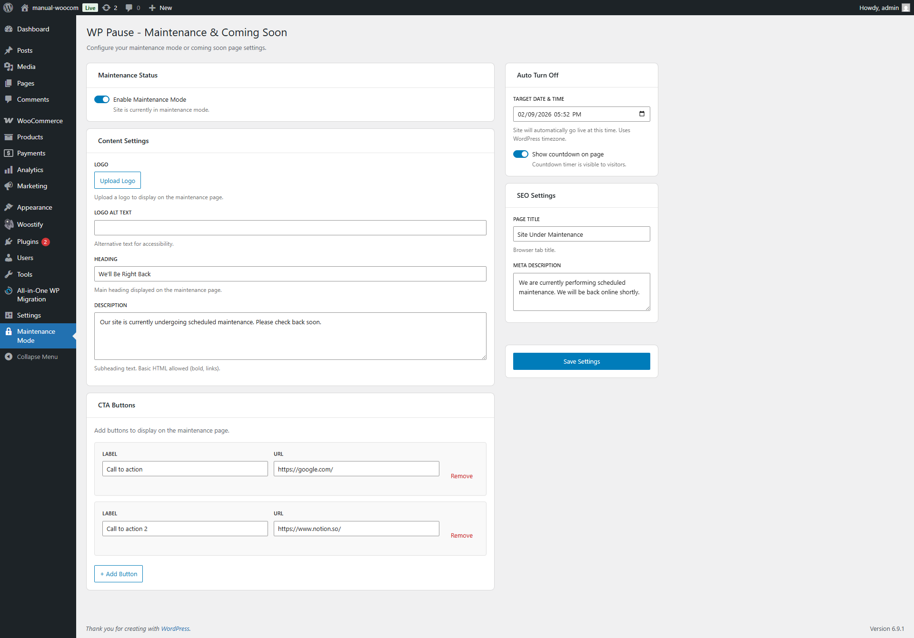
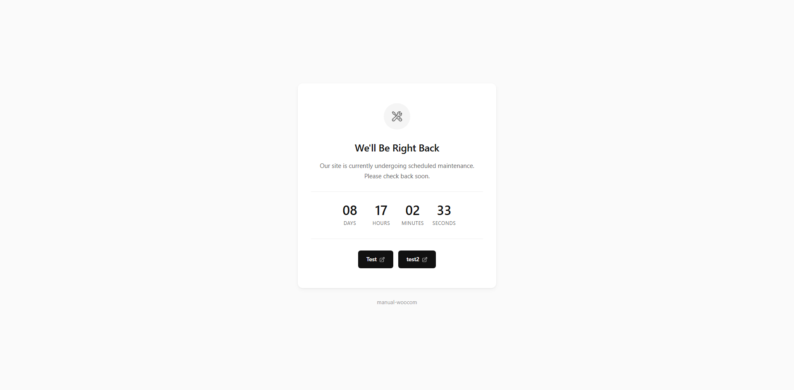

# WP Pause - Maintenance & Coming Soon

**Lightweight Maintenance Mode & Coming Soon page for WordPress.**

Put your site in maintenance mode with a beautiful, fast-loading page. Perfect for site updates, redesigns, or launching new projects.

<!-- licenece is MIT licence -->

---

<!-- screenshots -->
## Screenshots

## ✨ Features

### Core Features
- **One-Click Activation** – Toggle maintenance mode on/off instantly
- **Beautiful Design** – Modern, clean, neutral-colored maintenance page
- **Coming Soon Mode** – Use the same page for pre-launch announcements
- **Countdown Timer** – Optional countdown with Days, Hours, Minutes, Seconds
- **Custom Branding** – Upload your logo with alt text for accessibility
- **Custom Content** – Editable heading and description (supports basic HTML)
- **CTA Buttons** – Add unlimited call-to-action buttons (Contact, Social links, etc.)

### SEO & Performance
- **Proper HTTP 503 Status** – Tells search engines your site is temporarily unavailable
- **Retry-After Header** – Instructs crawlers when to check back
- **No Caching** – Prevents browsers and plugins from caching the maintenance page
- **Zero JavaScript** – Frontend loads with pure HTML/CSS (when countdown is disabled)*
- **No External Requests** – No Google Fonts, no CDNs, no third-party tracking
- **Inline CSS** – Everything in a single HTML response for fastest load time

### Access Control
- **Admin Bypass** – Logged-in Administrators can view the live site while maintenance mode is active

### Developer-Friendly
- **REST API** – All settings accessible via REST API with proper authentication
- **WordPress Timezone** – Countdown uses your WordPress timezone setting
- **Clean Codebase** – PSR-4 autoloading, PHP 8.1+ strict types
- **No Database Queries** – Settings autoloaded for zero additional DB overhead

> *\*The "Zero JavaScript" feature applies when the countdown timer is disabled. When enabled, a minimal inline script (~40 lines) powers the countdown.*

---

## 🚀 Advantages Over Other Plugins

| Feature | WP Pause | Others |
|---------|----------|--------|
| **Frontend JS** | Zero (or minimal)* | Heavy JS libraries |
| **External Requests** | None | Google Fonts, CDNs |
| **HTTP Status Code** | Proper 503 | Often 200 (bad for SEO) |
| **Page Load** | Single HTML response | Multiple requests |
| **Database Impact** | Zero additional queries | Multiple queries |
| **Bloat** | Lean & focused | Feature overload |
| **Modern PHP** | PHP 8.1+ strict | Legacy support |
| **Admin UI** | React-powered | jQuery-based |

### Why WP Pause?

1. **SEO-Safe** – Returns proper 503 status code with Retry-After header, so Google knows you're temporarily unavailable (not gone forever).

2. **Lightning Fast** – The maintenance page loads in a single request with inline CSS. No external fonts, no analytics, no CDN calls.

3. **Developer-First** – Built with modern PHP standards, REST API, and clean architecture. Easy to extend or customize.

4. **Privacy-Focused** – Zero third-party services. Your visitors' data stays on your server.

5. **Accessibility Ready** – Semantic HTML, WCAG-compliant contrast ratios, and proper alt text support.

---

## 📖 How to Use

### Installation

1. Upload the `pausewp` folder to `/wp-content/plugins/`
2. Activate the plugin through the **Plugins** menu
3. Go to **Settings → Maintenance Mode**

### Basic Setup

1. **Enable Maintenance Mode**
   - Toggle the switch to activate
   - Your site is now in maintenance mode

2. **Customize Content**
   - Set your **Heading** (e.g., "Coming Soon" or "Under Maintenance")
   - Add a **Description** with basic HTML support
   - Upload your **Logo** for brand recognition

3. **Add CTA Buttons** (Optional)
   - Click **+ Add Button**
   - Enter Label (e.g., "Contact Us") and URL
   - Add as many buttons as needed

4. **Enable Countdown** (Optional)
   - Toggle **Show Countdown** in the sidebar
   - Select your **Target Date & Time**
   - The countdown uses your WordPress timezone

5. **Configure SEO**
   - Set the **Page Title** (browser tab)
   - Add a **Meta Description** for search engines

6. **Save Settings**
   - Click **Save Settings** to apply changes

### Testing Your Page

1. Open an **Incognito/Private window**
2. Visit your website URL
3. You should see the maintenance page

> **Tip:** As an administrator, you'll always see the live site. Use incognito mode to preview the maintenance page.

---

## ❓ FAQs

### General

**Q: Will search engines de-index my site during maintenance?**
> No. WP Pause returns a proper HTTP 503 (Service Unavailable) status code with a Retry-After header. This tells search engines that the downtime is temporary, preserving your SEO rankings.

**Q: Can I use this as a Coming Soon page?**
> Absolutely! Simply change the heading to "Coming Soon" and enable the countdown timer. The plugin works perfectly for pre-launch pages.

**Q: Does the countdown timer use JavaScript?**
> Yes, when the countdown is enabled, a minimal inline script (~40 lines) is included. When disabled, the page is 100% HTML/CSS with zero JavaScript.

### Access & Permissions

**Q: How do I preview the maintenance page as an admin?**
> Open an incognito/private browser window and visit your site. Logged-in administrators automatically bypass maintenance mode.

**Q: Can I let my client access the site during maintenance?**
> Yes! Give them a WordPress Administrator account. Only logged-in Administrators can bypass maintenance mode.

**Q: Which user roles can bypass maintenance mode?**
> Currently, only Administrators can bypass. More role options coming in a future update.

### Technical

**Q: Does this plugin slow down my site?**
> No. The plugin uses autoloaded options, meaning WordPress already has the settings in memory. Zero additional database queries are made.

**Q: Why isn't my maintenance page showing?**
> Make sure:
> 1. Maintenance mode is **enabled**
> 2. You're viewing in **incognito mode** (admins bypass by default)
> 3. Page caching is cleared

**Q: Can I customize the design with CSS?**
> Currently, the design uses inline CSS for performance. Custom CSS support is planned for a future release. 

**Q: Does it work with page caching plugins?**
> Yes. WP Pause sends proper cache-control headers to prevent caching of the maintenance page.

### Countdown Timer

**Q: What timezone does the countdown use?**
> The countdown uses your WordPress timezone setting (Settings → General → Timezone).

**Q: What happens when the countdown reaches zero?**
> The countdown timer simply hides. Maintenance mode remains active until you manually disable it.

---

## 🔧 Requirements

- WordPress 6.4 or higher
- PHP 8.1 or higher

---

## 📝 Changelog

### 1.0.0
- Initial release
- Maintenance mode with custom heading/description
- Logo upload with alt text
- CTA buttons (unlimited)
- Countdown timer
- SEO settings (title, meta description)
- Admin bypass (logged-in admins see live site)
- Proper HTTP 503 + Retry-After headers
- Zero external requests
- React-powered admin interface

---

## 📄 License

This plugin is licensed under the [MIT](https://opensource.org/licenses/MIT).

---

## 🤝 Support

Found a bug or have a feature request? [Open an issue](https://github.com/sirjadeja/pausewp/issues) on GitHub.

---

**Made with ❤️ for the WordPress community**
